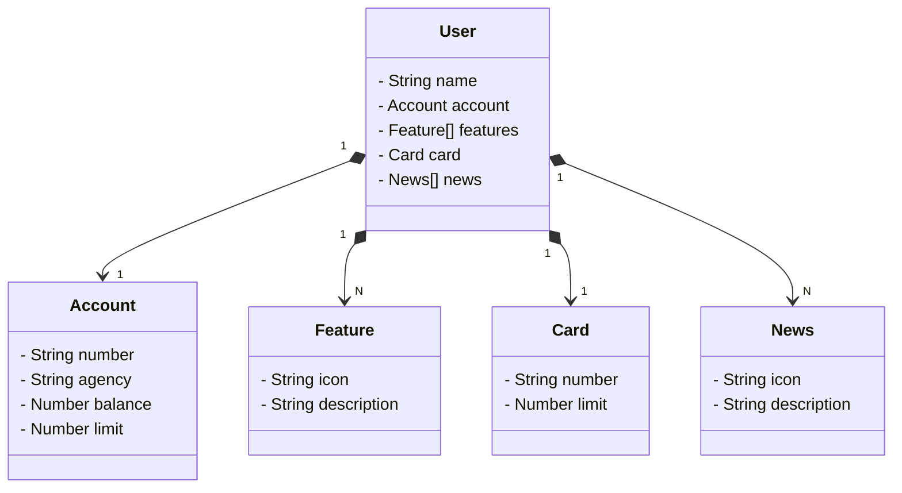

## Api do Santander feita durante o Curso da Dio

## Diagrama de Classes

## Testes no postman urls 

Criar novo usuario
localhost:8080/users

Buscar usuario pelo id
localhost:8080/users/id

# Análise de Sentenças com IA

Este projeto demonstra a análise de algumas sentenças utilizando inteligência artificial. 

## Processo
1. Criamos um repositório no GitHub e adicionamos uma pasta inputs com o arquivo sentencas.txt.
2. No arquivo de texto, adicionamos algumas sentenças para serem analisadas.

## Insights
Durante a análise, podemos perceber que a IA foi capaz de identificar a estrutura gramatical das frases e até mesmo entender o contexto de algumas delas, como o clima e as preferências pessoais.

## Possibilidades Futuras
Este projeto pode ser expandido para incluir a análise semântica das sentenças e até mesmo integração com modelos de IA para gerar respostas inteligentes.

# Pesquisa utilizando Azure com Java

Este repositório contém o passo a passo de como configurar uma pesquisa utilizando o **Azure Cognitive Services** com a linguagem **Java**. O objetivo é explorar como podemos usar as ferramentas de IA do Azure para realizar análises de texto, como análise de sentimentos e extração de entidades.

## Passo 1: Preparação do Ambiente

Antes de começar, você precisará de uma conta no Azure. Se não tiver uma, crie uma [aqui](https://portal.azure.com/).

### 1.1 Criar um recurso no Azure

1. Acesse o [Azure Portal](https://portal.azure.com/).
2. Busque por **Cognitive Services** e crie um novo recurso.
3. Escolha a região e tipo de API que você deseja usar (por exemplo, Text Analytics API para análise de sentimentos e reconhecimento de entidades).

### 1.2 Instalar o SDK do Azure para Java

Para usar os serviços do Azure em Java, você precisa adicionar as dependências do SDK no seu projeto Java. Se estiver usando **Maven**, adicione o seguinte ao seu arquivo pom.xml:

xml
<dependencies>
    <dependency>
        <groupId>com.azure</groupId>
        <artifactId>azure-ai-textanalytics</artifactId>
        <version>5.0.0</version>
    </dependency>
</dependencies>

# Reconhecimento de Texto em Imagens

Este repositório contém o processo de análise de imagens para reconhecimento de texto usando OCR (Reconhecimento Óptico de Caracteres). O objetivo deste projeto foi aplicar a tecnologia de reconhecimento de texto em tirinhas e analisar o conteúdo delas.

## Estrutura do Repositório

- **inputs/**: Contém as imagens utilizadas para análise.
- **output/**: Contém os resultados do reconhecimento de texto nas imagens.

## Passo a Passo

1. **Carregar as Imagens**: O processo começou com o upload de imagens contendo tirinhas ou outros textos que precisavam ser analisados.
2. **Reconhecimento de Texto**: Utilizamos uma ferramenta de OCR para processar as imagens e extrair os textos delas.
3. **Armazenamento dos Resultados**: Os textos extraídos             Ajuste pq abaixo das dependenciaas quando dou commit op conteudo fica la dentro